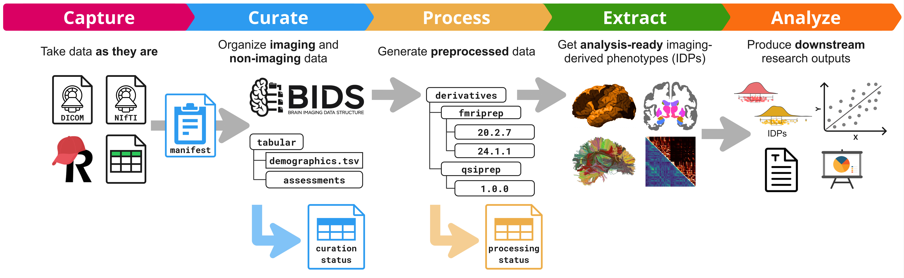

# Nipoppy

Nipoppy is a framework for facilitating the collection, curation, and
analysis of neurimaging data in a BIDS dataset. I provides stanard and
reproducible workflows for converting DICOM data into NIfTI files in
the BIDS format. The goal is to make data products that rely on the on
the FAIR principals (Findable, Accessible, Interoperable, Reusable).

Be sure to check out the [youtube
tutorials!](https://www.youtube.com/@Nipoppy-tutorials)



The framework includes three components:
	1. A protocol for data wrangling to standardize generation of
	   analysis-ready datasets
	2. A specification for dataset organization that extends the Brain
	   Imaging Data Structure (BIDS) standard
	3. A command-line interface and Python package that provide
	   user-friendly tools for applying the framework

It is a result of data-wrangling PTSD from our own experiences as data
managers and researchers. Nipoppy helps researchers to translate FAIR
principles into practice by providing a step-by-step protocol together
with a specification and Python package to navigate the steps of data
curation, processing, tracking, and more!

If the data-wrangling is hard enough for a single dataset, imagine
coordinating these efforts to ensure consistent data curation and
processing across multiple datasets! Even when the data are in BIDS
(bless the standard and its maintainers), there are a number of
questions that a full study processing adventure needs to address.

Given the heterogeneity in data, tools, and usage practices, we don’t
think there is one technical solution that fits all. Thus, Nipoppy
tries to engage with the users to show and instill best-practices that
would empower them to make better decisions for their custom research
workflows. We hope to proliferate FAIR datasets in the global
community - neuroimaging and beyond - striving towards more open,
reproducible, and translational neuroscience research.

## Quickstart

This page is intended to give you a quick first run through the
curation and processing stages with Nipoppy using real DICOM data from
an example dataset.

**Important** - See the Installation instructions first if you have
not yet installed Nipoppy and do not forget to activate your Nipoppy
environment.

### Download the example dataset

`git clone https://github.com/nipoppy/tutorial-dataset.git`

### Initializing a new dataset

To initialize a Nipoppy dataset:

`nipoppy init --dataset my-example-study`

**Important** - The newly created directory tree follows the Nipoppy
specification. Other Nipoppy commands expect all these directories to
exist – they will throw an error if that is not the case.

### Move the example dataset and files into your Nipoppy dataset:

`mv tutorial-dataset/manifest.tsv my-example-study`

`mv tutorial-dataset/reorg/*
my-example-study/sourcedata/imaging/pre_reorg`

`mv tutorial-dataset/bidsify/dcm2bids_config.json
my-example-study/code`

`mv tutorial-dataset/bidsify/participants.tsv
tutorial-dataset/bidsify/dataset_description.json
my-example-study/bids`

See the `dcm2bids` docs for info about the `dcm2bids_config.json` and
the BIDS docs for info about valid BIDS dataset requirements.

### Change directory into your Nipoppy dataset:

`cd my-example-study`

### Creating/modifying required files and customizing the global configuration file

The global configuration file at
`<NIPOPPY_PROJECT_ROOT>/global_config.json` starts out like this:

```
{
	"SUBSTITUTIONS": {
		"[[NIPOPPY_DPATH_CONTAINERS]]": "[[NIPOPPY_DPATH_ROOT]]/containers",
		"[[HPC_ACCOUNT_NAME]]": ""
	},
	"DICOM_DIR_PARTICIPANT_FIRST": true,
	"CONTAINER_CONFIG": {
		"COMMAND": "apptainer",
		"ARGS": [
			"--cleanenv"
		],
		"ENV_VARS": {
			"PYTHONUNBUFFERED": "1"
		}
	},
	"HPC_PREAMBLE": [
		"# (These lines can all be removed if not using HPC functionality.)",
		"# ========== Activate Python environment ==========",
		"# Here we need the command to activate your Python environment in an ",
		"# HPC job, for example:",
		"# - venv:  source <PATH_TO_VENV>/bin/activate",
		"# - conda: source ~/.bashrc; conda activate <ENV_NAME>",
		"# ========== Set environment variables ==========",
		"export PYTHONUNBUFFERED=1"
	],
	"PIPELINE_VARIABLES": {
		"BIDSIFICATION": {},
		"PROCESSING": {},
		"EXTRACTION": {}
	},
	"CUSTOM": {}
}
```
Fields that may need to be modified depending on your setup:

If you are on a system that uses `singularity` instead of `apptainer`,
you need to change `CONTAINER_CONFIG` -> COMMAND to "singularity"
instead of "apptainer"

If your group uses a shared directory for storing container image
files, you can replace `"[[NIPOPPY_DPATH_ROOT]]/containers"` by the
full path to that shared directory. Alternatively, you can create a
symlink from `<NIPOPPY_PROJECT_ROOT>/containers` to that directory
(then this line in the configuration can be deleted).

Customizing the `manifest.tsv` file

The example manifest file created at
`<NIPOPPY_PROJECT_ROOT>/manifest.tsv` by nipoppy init always looks
like this:

```
participant_id	visit_id	session_id	datatype
01	BL	BL	['anat']
01	M06
01	M12	M12	['anat']
02	BL	BL	['anat','dwi']
02	M06
02	M12	M12	['anat','dwi']
```
For our example study, we changed it to this:

(This is the `manifest.tsv` file you copied from the tutorial-dataset;
you will always have to modify the manifest.tsv according to your
study setup)

```
participant_id	visit_id	session_id	datatype
ED01	BL	BL	['anat', 'func', 'dwi']
ED02	BL	BL	['anat', 'func', 'dwi']
ED03	BL	BL	['anat', 'func']
ED04	BL	BL	['anat']
```

Prepare sourcedata for bidsification

1. Reorganize the sourcedata to simplify bidsification:

`nipoppy reorg`

2. Check the dataset status:

`nipoppy status`

Expected output:

```
			   Participant counts by session at each Nipoppy checkpoint
					  ╷             ╷              ╷               ╷
		   session_id │ in_manifest │ in_pre_reorg │ in_post_reorg │ in_bids
		  ════════════╪═════════════╪══════════════╪═══════════════╪═════════
			   BL     │      4      │      4       │       4       │    0
					  ╵             ╵              ╵               ╵
```

Pipeline setups

A newly initialized Nipoppy dataset does not contain any pipeline
setups or containers.  dcm2bids example

1. Search for the desired pipeline:

`nipoppy pipeline search dcm2bids`

2. Copy the Zenodo ID of version 3.2.0 of the pipeline (16876754 at
   the time of writing) and run:

`nipoppy pipeline install 16876754`

3. Choose to install the container as well or not: `y/n`

4. Check pipeline installation:

`nipoppy pipeline list`

Expected output:

```

INFO     Available bidsification pipelines and versions:
INFO            - dcm2bids (3.2.0)

```

Bidsify the sourcedata

Note

Please see the dcm2bids documentation to know what dcm2bids does and
how it works.

Usually you would start with running `nipoppy bidsify` with the first
`--pipeline-step` (e.g. prepare). For dcm2bids this step would run the
dcm2bids_helper in order to extract information from the dicom headers
to create a dcm2bids_config.json. We already provided you with a
`dcm2bids_config.json`, so we will skip this step here.

1. Replace the placeholder for `"DCM2BIDS_CONFIG_FILE"` in the
   `global_config,json` with the path to your code directory:

```
{
	# ...
	"PIPELINE_VARIABLES": {
		"BIDSIFICATION": {
			"dcm2bids": {
				"3.2.0": {
					"DCM2BIDS_CONFIG_FILE": "[[NIPOPPY_DPATH_ROOT]]/code/dcm2bids_config.json"
				}
			}
		}
	}
	# ...
}
```

2. Run bidsification:

`nipoppy bidsify --pipeline dcm2bids --pipeline-step convert`

3. Track the curation status:

nipoppy track-curation --regenerate

The curation status file can be found at
`<NIPOPPY_PROJECT_ROOT>/sourcedata/imaging/curation_status.tsv`.

4. Check the dataset status:

`nipoppy status`

Expected output:

```
			   Participant counts by session at each Nipoppy checkpoint
					  ╷             ╷              ╷               ╷
		   session_id │ in_manifest │ in_pre_reorg │ in_post_reorg │ in_bids
		  ════════════╪═════════════╪══════════════╪═══════════════╪═════════
			   BL     │      4      │      4       │       4       │    4
					  ╵             ╵              ╵               ╵
```

Run a processing pipeline on BIDS data

1. Search and install the `MRIQC` pipeline, `version 23.1.0` (and if
   necessary the container) as described above.

2. Check the pipeline installation:

`nipoppy pipeline list`

Expected output:

```
INFO     Available bidsification pipelines and versions:
INFO            - dcm2bids (3.2.0)
INFO     Available processing pipelines and versions:
INFO            - mriqc (23.1.0)

```

3. Create a new directory in the Nipoppy dataset root called
   templateflow (required by MRIQC, see TemplateFlow docs):

`mkdir templateflow`

4. Replace the placeholders (here: the templateflow path) in the
   `global_config.json`:

```
{
	# ...
	"PIPELINE_VARIABLES": {
		"BIDSIFICATION": {
			"dcm2bids": {
				"3.2.0": {
					"DCM2BIDS_CONFIG_FILE": "[[NIPOPPY_DPATH_ROOT]]/code/dcm2bids_config.json"
				}
			}
		},
		"PROCESSING": {
			"mriqc": {
				"23.1.0": {
					"TEMPLATEFLOW_HOME": "[[NIPOPPY_DPATH_ROOT]]/templateflow"
				}
			}
		},
		"EXTRACTION": {}
	}
	# ...
}
```

Note: You can also point to an already existing shared templateflow
directory, if you have access to one.

5. Run MRIQC on one participant:

`nipoppy process --pipeline mriqc --participant-id ED01`

6. Track the processing status:

`nipoppy track-processing --pipeline mriqc`

The processing status file can be found at
`<NIPOPPY_PROJECT_ROOT>/derivatives/processing_status.tsv`.

7. Check the dataset status:

`nipoppy status`

Expected output:
```
						   Participant counts by session at each Nipoppy checkpoint
					  ╷             ╷              ╷               ╷         ╷
					  │             │              │               │         │  mriqc
					  │             │              │               │         │  23.1.0
		   session_id │ in_manifest │ in_pre_reorg │ in_post_reorg │ in_bids │ default
		  ════════════╪═════════════╪══════════════╪═══════════════╪═════════╪══════════
			   BL     │      4      │      4       │       4       │    4    │    1
					  ╵             ╵              ╵               ╵         ╵
```

Tip: You can also upload your processing status file to the Neurobagel
digest dashboard at https://digest.neurobagel.org/ to get a nice
summary and visualization of your work!

## Advantages of Nipoppy

The Nipoppy framework offers several organizational, management, and
standardization advantages for converting raw neuroimaging data into
the Brain Imaging Data Structure (BIDS) format, compared to simply
executing a standalone BIDS conversion tool (like `dcm2bids`) without
the framework.

These advantages are primarily realized through structured data flow,
simplified deployment, and consistent tracking:

### 1. Structured Data Organization and Pre-BIDS Management

Nipoppy manages the entire lifecycle of raw data before BIDS
conversion, making the process cleaner and less error-prone:

*   **Handling "Messy" Source Data:** Nipoppy explicitly recognizes
	that raw "source data is often messy" when coming directly out of
	the scanner, making it hard to use BIDS conversion tools
	immediately.
*   **Reorganization Step (`nipoppy reorg`):** Nipoppy breaks the data
	preparation process down into a crucial intermediate step called
	reorganization (`post_reorg` status). This step ensures the raw
	data is consistently structured *before* BIDS conversion is
	attempted.
	*   It helps manage DICOM versus Nifti source data.
	*   It addresses issues related to file naming and chaotic data
		dumps.
	*   It enforces a standardized directory structure, such as
		prefixing participant folders with `sub-` and session folders
		with `ses-`, and removing modality-specific folders (e.g., in
		the `post_reorg` directory).
*   **Managing Participants and Sessions:** Raw data is ordered in a
	"participant first manner" ready for reorganization. Nipoppy uses
	the `manifest.tsv` file as the **"ground truth"** for all
	collected data, ensuring that only expected participants and
	sessions are processed.

### 2. Streamlined Pipeline Deployment and Containerization

Nipoppy facilitates the actual execution of the conversion tool,
ensuring it runs correctly and can be easily deployed, especially in
high-performance computing (HPC) environments:

*   **Uses Existing Tools:** Nipoppy itself is **not responsible for
	BIDS conversion** but manages the execution of existing BIDS
	conversion apps (e.g., `dcm2bids`) through their **containerized
	software**.
*   **Pipeline Setup and Configuration:** Nipoppy provides
	preconfigured descriptor files, default invocation files, and
	basic configuration files (`config.json`, `descriptor.json`,
	`invocation.json`) for popular processing pipelines, including
	bidsification tools.
*   **Simplified Delineation of Inputs:** For a tool like `dcm2bids`,
	Nipoppy organizes the process into steps like "prepare" and
	"convert". The "prepare" step extracts necessary information (like
	acquisition protocols from DICOM headers) from a single
	participant, helping users manually create the required
	configuration files (e.g., `dcm2bids_config.json`) needed for the
	mass "convert" step. This structuring simplifies the necessary
	manual work required for BIDS mapping.

### 3. Consistent Tracking and Curation Status

Nipoppy includes built-in data management features to track the status
of the data throughout the conversion process, which is critical for
large datasets:

*   **Curation Status File:** Nipoppy maintains the
	`curation_status.tsv` file, which tracks whether source imaging
	data is in the `pre-reorg`, `post-reorg`, or `in_bids` state for
	each participant/session.
*   **Status Commands:** The `nipoppy status` command provides quick
	sanity checks and helps identify debugging points early by
	summarizing the curation status of all participants.
*   **Automatic Updates:** The `nipoppy reorg` command includes an
	automatic update of the curation status file, preventing manual
	tracking errors.
*   **Handling HPC Jobs:** If parallel HPC jobs are used for
	conversion, the standard automatic status update may become
	inaccurate due to race conditions. Nipoppy provides a specific
	command (`nipoppy track-curation --regenerate`) to reliably update
	the `curation_status.tsv` file after conversion is complete,
	ensuring accuracy.

In summary, Nipoppy provides a **management layer** that standardizes
directory structure, isolates the conversion task, handles data
preparation *before* conversion, streamlines container deployment, and
provides continuous, traceable tracking of the data state, ensuring a
robust and reproducible transition from raw data to BIDS format.
